<div align="center">

<!-- Animated Header Banner -->


<br />

<!-- Badges -->
<p align="center">
  <a href="#-key-features"></a>
  <a href="#-institution--authorship"></a>
  <a href="#-multilingual-support"></a>
  <a href="https://render.com/deploy?repo=https://github.com/rohit112-1/Digital-Literacy"></a>
  <a href="https://github.com/rohit112-1/Digital-Literacy"></a>
</p>

<!-- Navigation Links -->
<p align="center">
  <b><a href="#-key-features">Key Features</a></b> •
  <b><a href="#-study-metrics--insights">Study Insights</a></b> •
  <b><a href="#-system-architecture">Architecture</a></b> •
  <b><a href="#-how-to-run">How to Run</a></b> •
  <b><a href="#-data-schema">Data Schema</a></b> •
  <b><a href="#-institution--authorship">Authorship</a></b>
</p>

</div>


## 🌟 Overview

**Digital Literacy Boisar** is a public data science and community engagement web platform presenting empirical findings from the research study:  
> *"Community Engagement Project: Digital Literacy Impact Assessment Using Data Science — A Study of Boisar, Palghar District"*

Developed for **Theem College of Arts, Commerce & Science — Department of Information Technology**, the platform bridges data research with community empowerment by providing interactive statistical charts, an anonymous digital self-assessment tool, downloadable digital safety guides, and a mentor administration portal.

---

## 📊 Study Metrics & Insights



<br />

The empirical research evaluates digital access, task execution skills, barriers, and practical life-impact across three key demographic cohorts in Boisar: **Students**, **MIDC Working Adults**, and **Homemakers / Parents**.

---

## 🏗️ System Architecture



---

## 🚀 Key Features

### 1. 📈 Public Insights & 7 Interactive Study Charts
- **Figure A1: Respondent Profile** — Age group distribution (15–20, 21–30, 31–40, 41–50, 51+) across 3 categories.
- **Figure A2: Digital Access Indicators** — Smartphone access, daily internet, UPI usage, and e-governance adoption.
- **Figure A3: Task Performance Gaps** — Identifies critical operational skill gaps (*Email Attachments: 45.0%*, *Govt e-Services: 51.7%*).
- **Figure A4: Literacy Score Distribution** — Classifies population scores into *Emerging (0–49)*, *Basic (50–69)*, *Functional (70–84)*, and *Strong (85–100)*.
- **Figure A5: Barriers to Digital Literacy** — Pinpoints *Fear of Fraud & Scams (48.3%)* as the #1 obstacle.
- **Figure A6: Practical Impact Comparison** — Evaluates everyday utility across 5 life dimensions on a 1–5 scale.
- **Figure A7: Score vs. Impact Index** — Linear regression analysis highlighting strong correlation ($r \approx 0.73$).
- Includes category filtering and expandable raw tabular data views.

---

### 2. 📱 Mobile-First Digital Self-Check
- Step-by-step 5-minute task questionnaire based on Appendix A & C of the study.
- **Automated Score Engine**: Generates composite score (0–100) and instant skill category classification.
- **Personalized Action Plan**: Provides targeted training advice tailored to the user's lowest-scoring area.
- **Anonymous Session ID**: Generates client tokens (e.g. `DLB-4921`) for longitudinal progress tracking without personal identification.
- **Zero PII Guarantee**: No mobile numbers, names, or passwords collected.

---

### 3. 📚 Training & Community Resources Hub
- **7-Session Workshop Plan** (from Appendix F) with interactive seat booking.
- **Three Printable / Downloadable Handbooks**:
  1. 🛡️ *Cyber-Safety & Scam Avoidance Checklist*
  2. 💳 *Safe UPI & Mobile Payments Handbook*
  3. 🏛️ *Aaple Sarkar & DigiLocker Step-by-Step Guide*
- **Assisted E-Service Help Desk Directory**: Campus locations, hours, and mentor assistance schedules.

---

### 4. 🌐 Multilingual Support (EN / HI / MR)
- Instant client-side switching between **English**, **Hindi (हिंदी)**, and **Marathi (मराठी)**.
- Full Devanagari font rendering optimized with Google Fonts (*Noto Sans Devanagari*).

---

### 5. 🔐 Mentor & Coordinator Console
- PIN-protected coordinator dashboard (Demo PIN: `1725`).
- Real-time aggregate cohort metrics and survey response charts.
- **One-Click Data Export**: Download complete dataset in **CSV** or **JSON** format matching PRD specs.


---

## ☁️ Deployment on Render

This repository includes a `render.yaml` blueprint configuration for instant, zero-config deployment on Render.

[](https://render.com/deploy?repo=https://github.com/rohit112-1/Digital-Literacy)

### 1-Click Deployment (Recommended)
1. Click the **Deploy to Render** button above or navigate to [https://render.com/deploy?repo=https://github.com/rohit112-1/Digital-Literacy](https://render.com/deploy?repo=https://github.com/rohit112-1/Digital-Literacy).
2. Sign in to your Render account.
3. Click **Apply** to deploy the `digital-literacy-boisar` static site blueprint.

### Manual Setup on Render Dashboard
1. Go to [Render Dashboard](https://dashboard.render.com/) and click **New + ➔ Static Site**.
2. Connect your GitHub repository: `rohit112-1/Digital-Literacy`.
3. Configure settings:
   - **Name:** `digital-literacy-boisar`
   - **Branch:** `main`
   - **Build Command:** *(leave empty)*
   - **Publish Directory:** `./` (or `.`)
4. Click **Create Static Site**.

---

## 💻 How to Run

### Option 1: Direct Browser Launch (No Installation Required)
Simply locate `index.html` in your file explorer and double-click to open it in Chrome, Firefox, Edge, or Safari.

### Option 2: Local HTTP Server via Python
Execute in your command terminal:
```bash
git clone https://github.com/rohit112-1/Digital-Literacy.git
cd Digital-Literacy
python -m http.server 8000
```
Then visit [`http://localhost:8000`](http://localhost:8000) in your web browser.

### Option 3: Local Server via Node.js
```bash
npx serve Digital-Literacy
```

---

## 📂 Project Structure

```
Digital-Literacy/
├── index.html                  # Main responsive single-page web application
├── css/
│   └── styles.css              # Mobile-first stylesheet (WCAG 2.1 AA accessible)
├── js/
│   ├── app.js                  # Navigation, UI modals, workshop bookings
│   ├── data.js                 # 60-sample study dataset & schema
│   ├── i18n.js                 # English, Hindi, and Marathi localization engine
│   ├── charts.js               # Chart.js renderers for Figures A1–A7 & interactive filters
│   ├── self-check.js           # Assessment scoring engine & recommendations
│   └── admin.js                # Mentor console, session publisher, and CSV/JSON exporter
├── assets/
│   ├── favicon.svg             # Platform brand mark
│   ├── readme-header.svg       # Animated banner graphic
│   ├── stats-cards.svg         # Animated metrics grid
│   ├── architecture-flow.svg   # System architecture diagram
│   ├── divider.svg             # Section divider graphic
│   └── guides/                 # Printable HTML community handbooks
│       ├── cyber-safety-boisar-v1.2.html
│       ├── safe-upi-payments-v1.1.html
│       └── aaple-sarkar-digilocker-v1.0.html
└── README.md                   # Platform documentation
```

---

## 📋 Data Schema (PRD Section 8.1)

<details>
<summary><b>Click to expand full dataset schema dictionary</b></summary>

<br />

| Field | Type | Description |
| :--- | :--- | :--- |
| `respondent_id` | `string` | Anonymous client token (e.g. `DLB-101`) |
| `age_group` | `enum` | `15-20`, `21-30`, `31-40`, `41-50`, `51+` |
| `respondent_category` | `enum` | `student`, `working_adult`, `homemaker_parent` |
| `smartphone_access` | `boolean` | Household smartphone availability |
| `internet_frequency` | `ordinal` | `Daily`, `Occasionally` |
| `uses_phone_independently` | `boolean` | Autonomous phone usage without proxy dependency |
| `used_upi` | `boolean` | Prior digital payment experience |
| `used_egov` | `boolean` | Prior usage of Aaple Sarkar / DigiLocker |
| `used_educational` | `boolean` | Prior usage of online learning resources |
| `search_skill` | `boolean` | Ability to search & verify online information |
| `email_skill` | `boolean` | Ability to compose & attach files to email |
| `payment_skill` | `boolean` | Understanding UPI PIN is exclusively for sending money |
| `egov_skill` | `boolean` | Navigating online public e-governance forms |
| `cyber_safety` | `boolean` | Identifying phishing and power-cut fraud scams |
| `digital_literacy_score` | `integer` | Computed composite score (0–100) |
| `digital_impact_index` | `float` | Self-reported everyday utility scale (1.0–5.0) |
| `primary_barrier` | `string` | Top obstacle reported by respondent |
| `submitted_at` | `timestamp` | ISO 8601 timestamp |

</details>

---

## 👥 Institution & Authorship

- **Source Study:** *Community Engagement Project: Digital Literacy Impact Assessment Using Data Science*
- **Academic Institution:** **Theem College of Arts, Commerce & Science**, Boisar, Palghar District, Maharashtra
- **Department:** Department of Information Technology
- **Project Team:**
  - **Rohit Kumar Prasad** (Roll No. 17)
  - **Sunny Singh** (Roll No. 25)
- **Project Mentor:** **Prof. Sarvesh K Kasar**
- **Platform Release:** Version 1.0 (September 2026)

---

## 📜 Disclaimer & License

*Dashboard statistics are derived from an academic research dataset ($n=60$) conducted for educational research and curriculum design at Theem College of Arts, Commerce & Science. It does not constitute official government figures.*

Distributed under the **MIT License**. See `LICENSE` for more information.

<div align="center">
  <br />
  <p>Made with ❤️ by the Dept. of IT, Theem College — Boisar</p>
</div>

